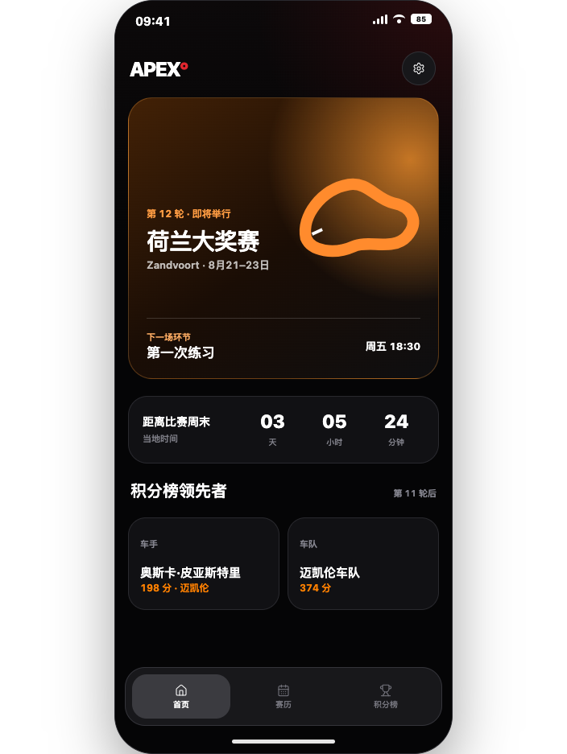
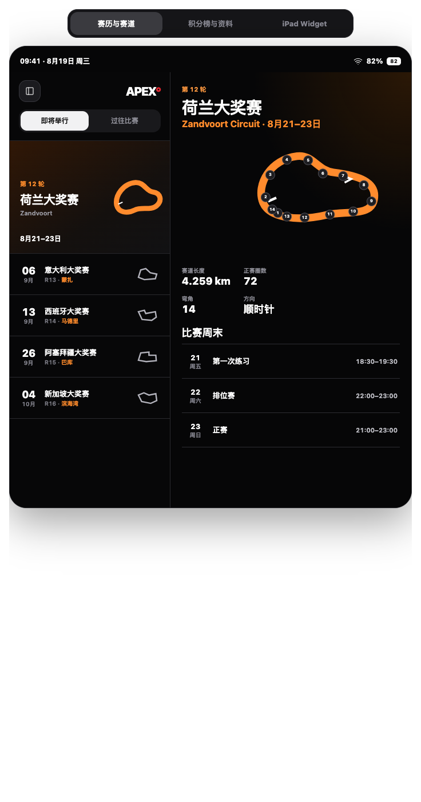

# Apex

Apex 是一个面向个人使用的非官方方程式赛车 iPhone 与 iPad 信息应用，聚焦赛历、赛道、比赛结果与赛季积分榜。

## 当前状态

产品范围、iPhone/iPad 视觉方案、数据与技术架构已经冻结。开发资源基线已建立，包含 Design Tokens、2026 种子数据和赛道几何资产。`ApexCore` 已完成领域模型、本地资源解析、Jolpica/OpenF1 网络映射、离线优先存储接口和 Widget App Group 快照；App/Widget Target 与 SwiftUI 页面尚未开始。

## 首发范围

- 首页：下一场大奖赛、下一环节和倒计时
- 赛历：全年比赛、比赛周末详情和设备时区时间
- 赛道：单色赛道预览、弯角编号、起终点、方向和维修区
- 结果：练习赛、排位赛、冲刺赛及正赛结果
- 积分榜：车手积分榜和车队积分榜
- 资料页：车手详情、车队详情和赛季统计
- Widget：下一场比赛、周末日程、车手与车队摘要
- 设置：语言、设备时区、赛季与本地缓存
- iPad：主从分栏浏览，以及 Large 与 Extra Large Widget

## 明确不做

- 实时排名或实时遥测
- “我的车手”、收藏或关注
- 通知、比赛提醒或加入系统日历
- 账号、订阅、付费或商业化功能
- 新闻、社区、竞猜或 Fantasy 功能

## 文档

- [产品规格](docs/product-spec.md)
- [数据方案](docs/data-plan.md)
- [技术设计](docs/technical-design.md)
- [原型与设计稿](design/README.md)
- [开发资源包](Resources/README.md)

## 开发资源

- `Resources/DesignTokens`：颜色、字号、间距、圆角和自适应布局约束
- `Resources/Seed/2026`：23 站赛历、22 位正赛车手和 11 支车队的中英文基线
- `Resources/Tracks/2026`：单色赛道轮廓及弯角编号坐标
- `Packages/ApexCore`：领域模型、本地资源解析、赛历计算、Jolpica/OpenF1 客户端、缓存、数据映射和 Repository
- `XcodeSupport/ApexSwiftData`：创建完整 Xcode 工程后加入 App Target 的 SwiftData 存储适配器
- `Scripts/validate-resources.sh`：资源完整性自动校验

## 原型预览

[打开完整可点击原型](design/prototypes/f1-clickable-prototype.html)

[打开 iPad 高保真原型](design/prototypes/f1-ipad-high-fidelity.html)

## 说明

本项目为个人、非商业、非官方项目，与 Formula 1、FIA 或任何参赛车队无关联。
