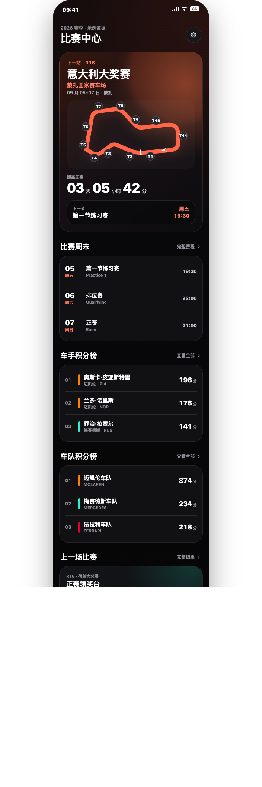
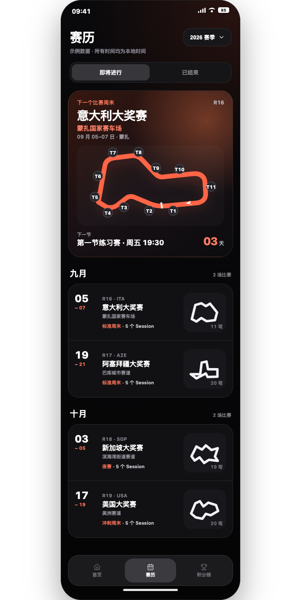
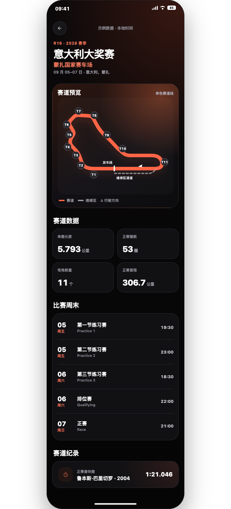
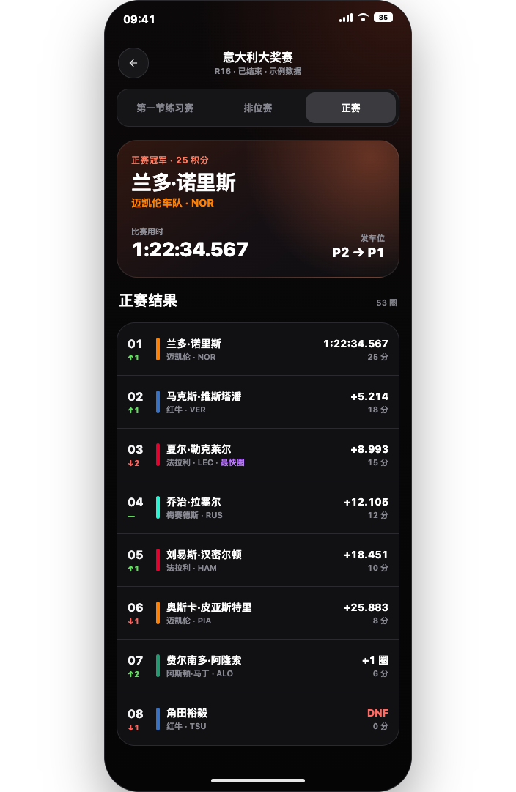
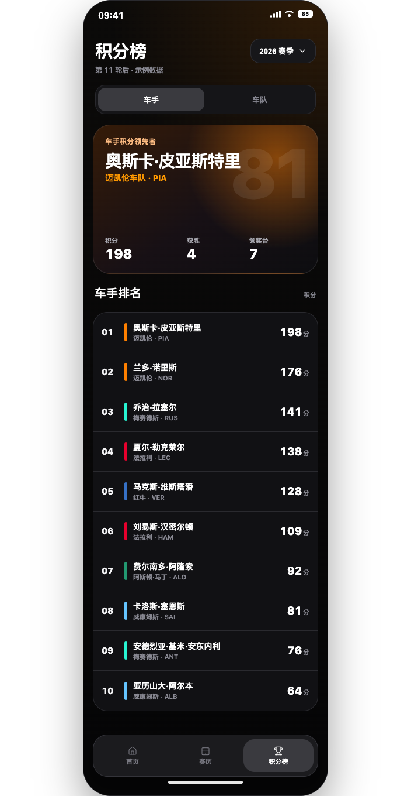
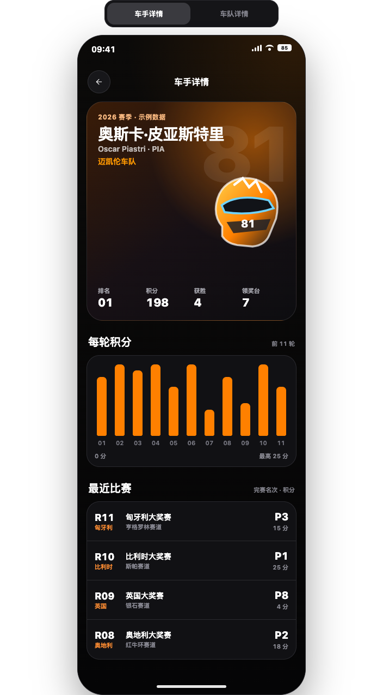
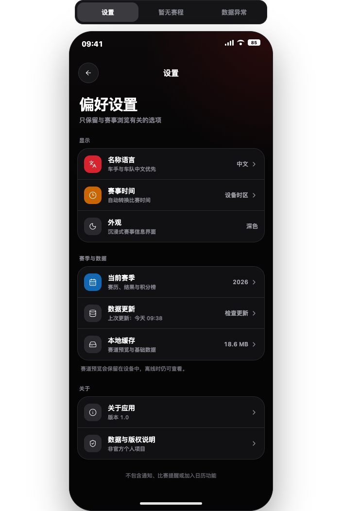
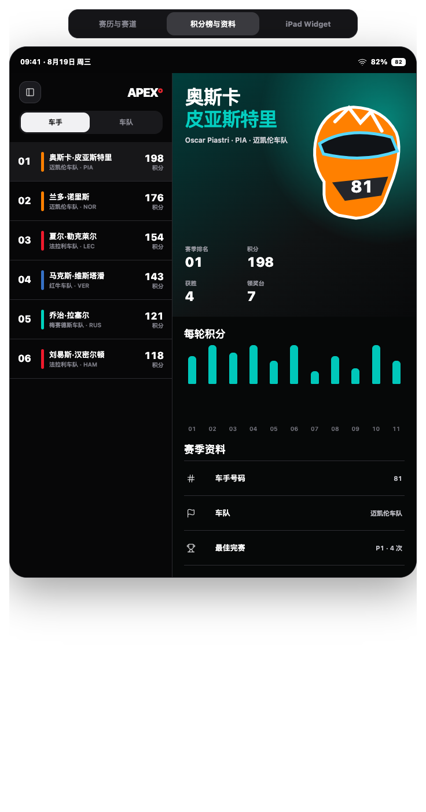
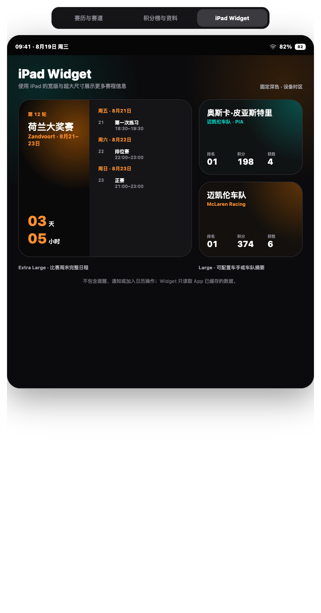
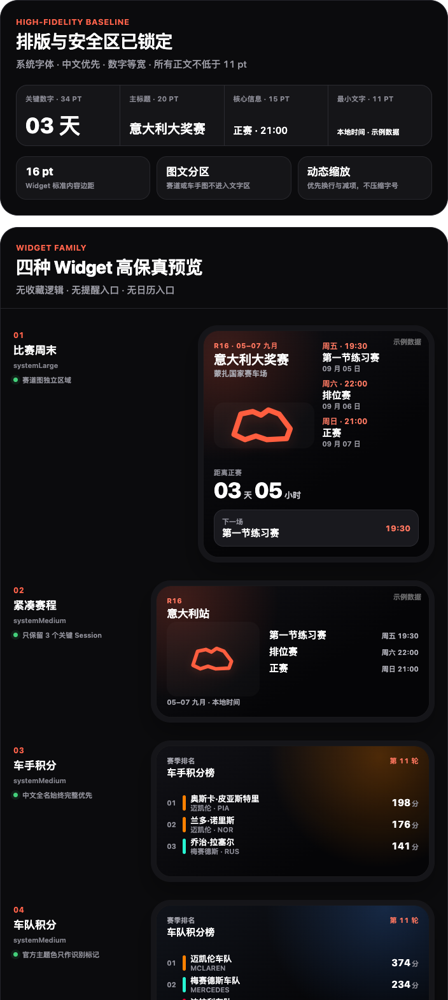

# Apex Atlas 原型与设计稿

本目录保存产品讨论阶段确认的线框图、高保真页面、Widget 方案和完整可点击原型。

## 完整可点击原型

- [浏览器版本](prototypes/f1-clickable-prototype.html)
- [源片段](fragments/f1-clickable-prototype.html)

浏览器版本支持以下页面跳转：

- 首页 → 大奖赛详情
- 首页 → 设置
- 首页 → 车手与车队详情
- 主导航 → 赛历与积分榜
- 赛历 → 大奖赛详情
- 大奖赛详情 → 环节结果
- 积分榜 → 车手与车队详情
- 子页面返回

## 高保真 App 页面

### 首页

- [浏览器版本](prototypes/f1-home-high-fidelity.html)
- [源片段](fragments/f1-home-high-fidelity.html)

### 赛历

- [浏览器版本](prototypes/f1-calendar-high-fidelity.html)
- [源片段](fragments/f1-calendar-high-fidelity.html)

### 大奖赛详情与赛道预览

- [浏览器版本](prototypes/f1-grand-prix-detail-high-fidelity.html)
- [源片段](fragments/f1-grand-prix-detail-high-fidelity.html)

### 环节结果

- [浏览器版本](prototypes/f1-session-results-high-fidelity.html)
- [源片段](fragments/f1-session-results-high-fidelity.html)

### 积分榜

- [浏览器版本](prototypes/f1-standings-high-fidelity.html)
- [源片段](fragments/f1-standings-high-fidelity.html)

### 车手与车队详情

- [浏览器版本](prototypes/f1-profiles-high-fidelity.html)
- [源片段](fragments/f1-profiles-high-fidelity.html)

### 设置与状态页面

- [浏览器版本](prototypes/f1-settings-states-high-fidelity.html)
- [源片段](fragments/f1-settings-states-high-fidelity.html)

## iPad 高保真方案

- [浏览器版本](prototypes/f1-ipad-high-fidelity.html)
- [源片段](fragments/f1-ipad-high-fidelity.html)

iPad 采用主从分栏：左侧保留赛历或积分榜列表，右侧展示赛道、车手或车队详情。原型包含三个可切换状态：

- 赛历与赛道
- 积分榜与资料
- iPad Widget

## Widget

- [Widget 视觉规格](prototypes/f1-widget-visual-spec.html)
- [Widget 视觉规格源片段](fragments/f1-widget-visual-spec.html)
- [Widget、资料与设置早期方案](prototypes/f1-profiles-widgets-settings.html)

## 线框图

- [核心页面线框图](prototypes/f1-ios-wireframes.html)
- [结果与积分榜线框图](prototypes/f1-results-standings-wireframes.html)

## 目录说明

- `fragments/`：可继续编辑的设计源片段
- `prototypes/`：可在本地浏览器直接打开的独立 HTML
- `previews/`：便于在 GitHub README 中浏览的 PNG 预览

这些页面使用示例数据表达信息层级和交互，不代表最终真实赛季数据。
